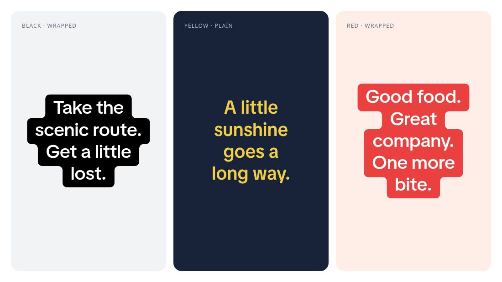

<div align="center">

# TikTok Style Wrapped Text

Make organic-looking TikTok content with HTML.

Connected rounded backgrounds · Smart width snapping · TikTok Sans · One HTML tag

<p align="center">
  <a href="https://github.com/Amargol/tiktok-style-wrapped-text/actions/workflows/publish.yml"></a>
  <a href="https://www.npmjs.com/package/tiktok-style-wrapped-text"></a>
  <a href="https://www.npmjs.com/package/tiktok-style-wrapped-text"></a>
  <a href="LICENSE"></a>
</p>

**[Quick start](#quick-start) · [Visual examples](#visual-examples) · [API](#api-reference) · [React](#react--tailwind) · [How it works](#how-it-works)**

</div>




```html
<script type="module" src="./roundtext/roundtext.js"></script>

<tiktok-text size="48" color="teal">Find your<br>happy place.</tiktok-text>
```

## Why this exists

Captions are a big part of what makes a post feel like it was made inside TikTok. Recreating that look in HTML is tricky: each line needs its own background width, adjacent lines need to connect, and both the outside corners and the inward steps need to be rounded.

This library handles that geometry for you. Use it for short-form captions, HTML slideshows, carousels, and agent-created social content. The original text stays selectable in the DOM; an SVG background follows the browser's actual line breaks.

- **One tag:** use `<tiktok-text>` in plain HTML, or the optional React wrapper.
- **Connected backgrounds:** rounded outer corners and inward steps across multiple lines.
- **Intelligent snapping:** nearly equal line widths merge into clean blocks.
- **Four variants:** background, plain, outline, and hollow.
- **Eleven presets:** coordinated background, text, and outline colors; custom CSS colors work too.
- **Size-aware geometry:** padding, corners, and snapping scale with the font size.
- **Automatic updates:** responds to text changes, resizing, and font loading.
- **No runtime dependencies:** TikTok Sans, TypeScript types, and an optional React wrapper are included.

## Quick start

### 1. Install from npm

```sh
npm install tiktok-style-wrapped-text
```

Published as **[`tiktok-style-wrapped-text`](https://www.npmjs.com/package/tiktok-style-wrapped-text)**. The package includes the browser component, a compiled React wrapper, TypeScript declarations, and TikTok Sans with its license. React 18+ is an optional peer dependency needed only when using the React wrapper.

For plain HTML without a bundler, copy **`node_modules/tiktok-style-wrapped-text`** into your public assets as **`roundtext`**. You can also clone this repository and copy **`dist/lib`**. Keep the whole folder together, including `fonts/` and its license.

The `roundtext` filenames are retained for compatibility; the HTML element is `<tiktok-text>`.

### 2. Import once. Use the tag.

Choose the setup that matches your project. The library loads the bundled font automatically.

#### Plain HTML / static sites

Place the copied `roundtext` folder alongside your page, or in your site's public assets:

```html
<script type="module" src="./roundtext/roundtext.js"></script>

<tiktok-text size="48" color="teal">Find your<br>happy place.</tiktok-text>
```

Adjust the module URL to your asset location. Keep `fonts/` beside `roundtext.js` in the deployed assets. Works on static hosting, including GitHub Pages, without a framework or an HTML build step.

#### Vite / JavaScript / TypeScript bundlers

Import the installed package from your browser entry point:

```js
import 'tiktok-style-wrapped-text';
```

Then use `<tiktok-text>` in your templates. Your bundler must emit the included font referenced by the module's relative `new URL(...)`. Alternatively, keep the whole folder in public assets and load it with a module script as above.

#### React / Next.js

Use the supplied wrapper; it handles client-side registration:

```tsx
'use client'; // Needed for this component in Next.js App Router.

import { TikTokText } from 'tiktok-style-wrapped-text/react';

export default function Caption() {
  return (
    <TikTokText size={48} color="teal">
      {'Find your\nhappy place.'}
    </TikTokText>
  );
}
```

The bundled font is referenced by the package and emitted by supported bundlers; no manual folder copy is needed for a Vite build. [React + Tailwind](#react--tailwind) covers layout, refs, and integration status.

#### Vue 3 / Nuxt

Register the element on the client and use it in the template:

```vue
<script setup>
import { onMounted } from 'vue';
onMounted(() => { void import('tiktok-style-wrapped-text'); });
</script>

<template>
  <tiktok-text size="48" color="teal">Find your<br>happy place.</tiktok-text>
</template>
```

Tell Vue's template compiler that `tiktok-text` is a custom element. With Vite's Vue plugin:

```js
vue({
  template: {
    compilerOptions: {
      isCustomElement: tag => tag === 'tiktok-text',
    },
  },
})
```

For Nuxt, set the same predicate under `vue.compilerOptions.isCustomElement` in your Nuxt configuration. The client lifecycle import avoids registration during server rendering.

#### Svelte / SvelteKit

```svelte
<script>
  import { onMount } from 'svelte';
  onMount(() => { void import('tiktok-style-wrapped-text'); });
</script>

<tiktok-text size="48" color="teal">Find your<br>happy place.</tiktok-text>
```

Framework references: [Vue custom elements](https://vuejs.org/guide/extras/web-components.html) · [Svelte client lifecycle](https://svelte.dev/docs/svelte/lifecycle-hooks).

#### Other frameworks / server-rendered apps

Use it as a standard custom element: load the module in the browser, allow `tiktok-text` in your framework's template compiler if required, and pass the attributes below. For SSR, register it after client mount; text can render on the server, while backgrounds and outlines are added in the browser.

These are integration recipes. Chrome HTML rendering has been verified; framework-specific builds still need validation in your project. The plain HTML runtime also works by copying the library folder without npm.

## Visual examples

The image above is a browser screenshot of the actual `<tiktok-text>` component with its bundled font. No separately drawn text or background geometry. [Live examples](https://amargol.github.io/tiktok-style-wrapped-text/readme-examples/) · [HTML source](dist/readme-examples/index.html).

### Recreate these three examples

```html
<script type="module" src="./roundtext/roundtext.js"></script>

<!-- Black background, white multiline text. -->
<tiktok-text size="40" color="black">Take the<br>scenic route.<br>Get a little<br>lost.</tiktok-text>

<!-- Yellow plain text on a dark backdrop. -->
<div style="background: #182238; padding: 32px">
  <tiktok-text size="40" color="yellow" variant="plain">A little<br>sunshine<br>goes a<br>long way.</tiktok-text>
</div>

<!-- Red background, white multiline text. -->
<tiktok-text size="40" color="red">Good food.<br>Great company.<br>One more<br>bite.</tiktok-text>
```

### Four ways to style a caption

```html
<!-- White text on a connected black background (the default). -->
<tiktok-text size="62" variant="box">Take the<br>scenic route.</tiktok-text>

<!-- Plain text: use a dark backdrop for white lettering. -->
<div style="background: #172033; padding: 32px">
  <tiktok-text size="48" color="white" variant="plain">Make something worth sharing.</tiktok-text>
</div>

<!-- Filled letters with a rounded, contrasting outline. -->
<tiktok-text size="54" color="orange" variant="outline">Golden hour.</tiktok-text>

<!-- Transparent letter interiors reveal the actual backdrop. -->
<div style="background: linear-gradient(120deg, #4338ca, #be185d); padding: 32px">
  <tiktok-text size="53" color="white" variant="hollow">Stay curious.</tiktok-text>
</div>
```

`color` selects a coordinated preset, so its meaning follows the variant. For example, `color="black"` gives white lettering on black in `box` mode and black lettering in `plain` mode. White and hollow styles need a contrasting backdrop.

### Colors that work together


```html
<tiktok-text color="teal">Take the<br>scenic route.</tiktok-text>
<tiktok-text color="yellow">A little<br>sunshine.</tiktok-text>
<tiktok-text color="purple">One more<br>adventure.</tiktok-text>
<tiktok-text color="#be185d">Your own<br>brand color.</tiktok-text>
```

**Presets:** `black`, `white`, `red`, `orange`, `yellow`, `green`, `teal`, `cyan`, `blue`, `indigo`, `purple`.

Yellow uses brown lettering for contrast. Use the CSS overrides below when a custom background needs a different text or outline color.

### Small label. Big statement.

Change `size`; the padding and geometry scale with it. Each caption has one size, and different captions can use different sizes.

```html
<tiktok-text size="20" color="indigo">Big<br>ideas.</tiktok-text>
<tiktok-text size="28" color="indigo">Big<br>ideas.</tiktok-text>
<tiktok-text size="40" color="indigo">Big<br>ideas.</tiktok-text>
<tiktok-text size="56" color="indigo">Big<br>ideas.</tiktok-text>
```


### Near widths become one block


Snapping is on by default. Similar adjacent edges align, including chains of nearby widths; large changes still produce rounded steps.

```html
<!-- Similar widths form one clean block. -->
<tiktok-text size="34">less<br>noise<br>more<br>focus</tiktok-text>

<!-- Keep each line's original width. -->
<tiktok-text size="34" snap="off">less<br>noise<br>more<br>focus</tiktok-text>
```

### Wrapping and alignment

Use CSS to set the available width. Text wraps automatically; use `<br>` or literal newlines when you want specific breaks.

```html
<tiktok-text size="36" align="left" style="max-width: 360px">A little change of scene can change your whole day.</tiktok-text>

<tiktok-text align="center">Take the<br>scenic route.</tiktok-text>
<tiktok-text align="right">Take the<br>scenic route.</tiktok-text>
```

Newlines **and indentation** in the source are preserved. Keep content on one source line for automatic wrapping. Blank lines leave gaps. Put surrounding padding and borders on a wrapper, and place the component inside a heading when heading semantics are needed.

## API reference

| Attribute | Default | What it does |
| --- | --- | --- |
| `size` | `40` | Font size in pixels; geometry scales with it. |
| `color` | `black` | One of the eleven presets, or a CSS color. |
| `variant` | `box` | `box`, `plain`, `outline`, or `hollow`. |
| `align` | `center` | `left`, `center`, `right`, `start`, or `end`. |
| `snap` | `on` | Set to `off` to preserve individual line widths. |
| `debug` | absent | Presence shows the computed line bands. |

### Custom CSS

```html
<tiktok-text
  size="48"
  style="--rt-bg: #fce7f3; --rt-color: #831843; --rt-radius: 0.2em"
>Made for<br>your brand.</tiktok-text>
```

| CSS custom property | Default | Controls |
| --- | --- | --- |
| `--rt-bg` | From preset | Background fill. |
| `--rt-color` | From preset | Text fill. |
| `--rt-outline` | From preset | Glyph outline color. |
| `--rt-radius` | `0.23em` | Outer and inward corner radius. |
| `--rt-px` | `0.437em` | Horizontal padding. |
| `--rt-py` | `0.1335em` | Vertical outer padding. |
| `--rt-stroke` | `0.145em` | Full SVG stroke width; half extends outside each glyph. |
| `--rt-snap` | Twice the radius | Maximum adjacent edge difference for snapping. |

Radius, stroke, and snap accept pixel or `em` values. Padding accepts nonnegative CSS lengths, excluding percentages. Defaults are calibrated together with the included font; changing fonts or spacing changes the resulting look.

### Update text and capture output

```js
import { ready } from 'tiktok-style-wrapped-text';

const caption = document.querySelector('tiktok-text');
caption.textContent = 'A new caption\nwith two lines';
caption.setAttribute('color', 'purple');
caption.setAttribute('size', '48');

await ready();       // Wait for the bundled font.
caption.refresh();   // Measure and render synchronously before capturing.
```

Text edits, resizes, font loads, and component attribute changes schedule a refresh automatically. Call `refresh()` after external stylesheet changes that affect typography without resizing the component. `ready()` rejects if the font cannot load.

For image/video workflows, capture the rendered page after `ready()` and `refresh()`. Prefer an actual browser screenshot: some DOM-to-canvas exporters do not support Shadow DOM correctly. This library renders captions; it does not provide an image or video encoder.

| Event | Detail |
| --- | --- |
| `roundtext:render` | `{ lines, path, rectangles, unsnapped }`; `path` is the background shape. |
| `roundtext:error` | `{ message }` describing a rendering/font error. |

Listen directly on the element; `roundtext:render` does not bubble. Advanced consumers can import the pure geometry helpers `outline(rectangles, radius)` and `snapLines(rectangles, threshold)`, or the `colors` palette. [TypeScript definitions](dist/lib/roundtext.d.ts) are included.

## React + Tailwind

Install `tiktok-style-wrapped-text` and React 18+, then import the wrapper:

```tsx
import { TikTokText } from 'tiktok-style-wrapped-text/react';

export function Caption() {
  return (
    <div className="bg-slate-950 p-8">
      <TikTokText size={48} color="teal" className="max-w-md mx-auto">
        {'Find your\nhappy place.'}
      </TikTokText>
    </div>
  );
}
```

The npm wrapper includes compiled JavaScript and TypeScript declarations. The TSX source is also included for direct folder-based use. It registers the custom element on the client, forwards a ref exposing `refresh()`, and maps `className` to the element's class. Keep the font assets available beside the module in your bundler's output. React 18+ is required only for the wrapper; plain HTML needs no React or Tailwind. Package imports, TypeScript types, and server rendering have been checked with React 18 and 19; a Vite production build also verifies bundled font output. Client-side React mounting still needs browser integration testing.

## How it works

1. **Measure real text.** DOM Range measurements recover the browser's wrapped line fragments.
2. **Snap similar edges.** Neighboring edges are compared before expansion. Transitive groups align so near-width lines become straight blocks.
3. **Merge and round.** Overlapping line bands form a rectangle union. Circular arcs round both convex and concave corners.
4. **Keep text as text.** SVG draws the background behind the HTML. Outlined styles add rounded SVG glyph strokes; hollow mode masks the interiors.

See the [renderer source](dist/lib/roundtext.js) and [geometry tests](tests/geometry.test.js). The older `<round-text>` tag remains a compatibility alias with the same updated defaults.

## Reference comparisons and limits

Six supplied TikTok screenshots have executable recreations, original/recreation overlays, and measured differences. These reference tests are separate from the purpose-built examples above.

| Case | Recreation code | Overlay |
| --- | --- | --- |
| Plain, boxed, and multiline text | [HTML](dist/examples/basics.html) | [Comparison](dist/verification/basics-overlay.png) |
| Intelligent snapping | [HTML](dist/examples/snapping.html) | [Comparison](dist/verification/snapping-overlay.png) |
| Multiple sizes | [HTML](dist/examples/sizes.html) | [Comparison](dist/verification/sizes-overlay.png) |
| Color backgrounds | [HTML](dist/examples/colors.html) | [Comparison](dist/verification/colors-overlay.png) |
| Colored glyph borders | [HTML](dist/examples/borders.html) | [Comparison](dist/verification/borders-overlay.png) |
| Outlines and hollow text | [HTML](dist/examples/outlines.html) | [Comparison](dist/verification/outlines-overlay.png) |

**The output is not pixel-identical to TikTok.** Font contours, positioning, antialiasing, and screenshot compression still differ. [Measurements](dist/verification/metrics.json) distinguish foreground error from background overlap; the [verification methodology](dist/lib/README.md#reference-verification) explains how they are calculated.

Use short horizontal captions with one font size per component. Mixed-size inline content, vertical writing, columns, nested block layouts, and rotated/skewed measurement are outside scope. Glyph outlines are calibrated to the included font and left-to-right text. Chrome captures and playground interactions were checked; Safari and Firefox remain unverified.

Without JavaScript, text stays visible but connected backgrounds and outlines do not render. Server-rendered content may briefly show fallback styling while the font loads.

## License

Code: [MIT](LICENSE). Bundled TikTok Sans: [SIL Open Font License](dist/lib/fonts/OFL.txt), from [TikTok Sans](https://github.com/tiktok/TikTokSans).

Independent project; not affiliated with TikTok.

## Contributing

Make your changes on a branch and open a pull request. To run the playground and documentation locally:

```sh
npm ci
npm run dev
```

Before submitting, build the React wrapper, run the tests, and validate the documentation and download:

```sh
npm run build:lib
npm test
npm run build:docs
```

Include the generated JavaScript and TypeScript declarations when changing the React wrapper. The tests cover geometry, React server rendering, and release checks.

### Automatic npm releases

The [Publish to npm workflow](.github/workflows/publish.yml) runs on every push to `main`:

1. Install dependencies, build the library, and run the tests.
2. Check the version in [`dist/lib/package.json`](dist/lib/package.json) against npm.
3. Publish the library if that version is new, or skip publishing if it already exists.

To release, a maintainer updates `version` in `dist/lib/package.json` to a new stable version, such as `0.2.1`, and merges or pushes the change to `main`. Update the displayed documentation and download versions alongside the package version. The root `package.json` is the private documentation project; its version does not control npm releases.

npm Trusted Publishing is already configured for this repository's `publish.yml` workflow. Releases use short-lived GitHub credentials and require no stored npm token, manual npm login, or Touch ID approval. Version bumps are intentional: documentation-only changes with an unchanged package version do not publish a new release. Prerelease versions are not supported by this workflow, and failed builds, tests, or registry lookups stop publishing.

Check the result in [GitHub Actions](https://github.com/Amargol/tiktok-style-wrapped-text/actions). After resolving a failure, rerun the publishing workflow on `main`.

### GitHub Pages

The [Deploy docs workflow](.github/workflows/pages.yml) separately builds and tests the library, validates the documentation, generates the ZIP download, and deploys `dist` on every push to `main`. README and landing-page edits do not require an npm version bump. The live site is [TikTok Wrapped Text](https://amargol.github.io/tiktok-style-wrapped-text/).
