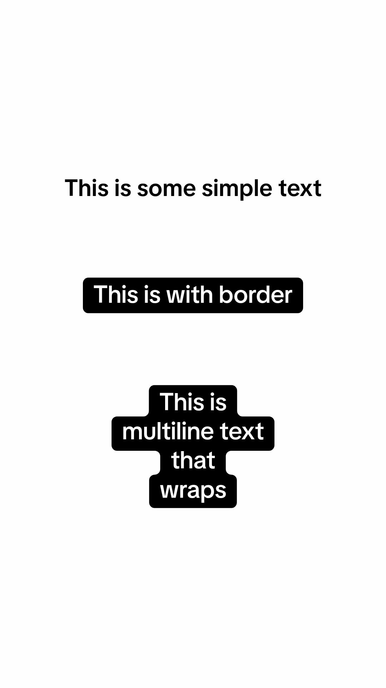
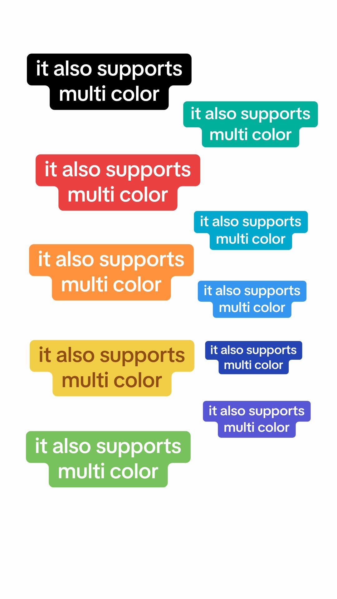
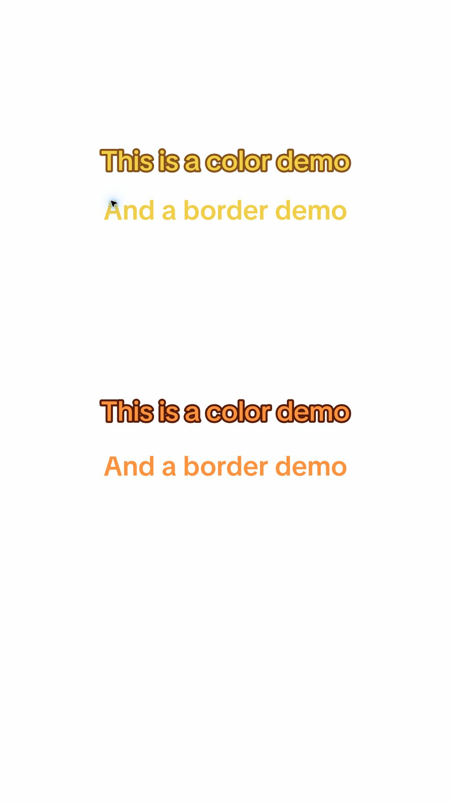
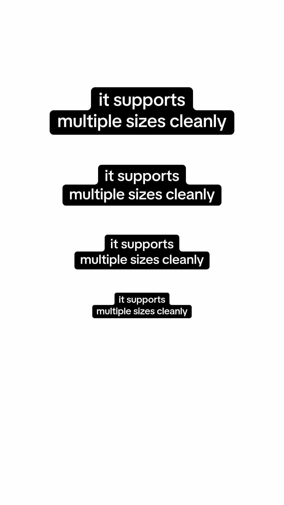
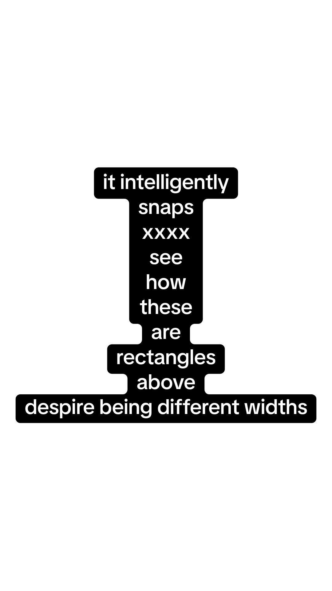

<div align="center">

# TikTok Style Wrapped Text

### Make organic-looking TikTok content with HTML.

Connected rounded backgrounds. Smart width snapping. TikTok Sans. One HTML tag.

**[Quick start](#quick-start) · [Visual examples](#visual-examples) · [API](#api-reference) · [React](#react--tailwind) · [How it works](#how-it-works)**

</div>

<table>
<tr><th>Wrapped backgrounds</th><th>Color presets</th><th>Outlined lettering</th></tr>
<tr>
<td></td>
<td></td>
<td></td>
</tr>
</table>

<p align="center"><sub>Actual library renders. Each reference recreation has <a href="dist/examples">executable HTML</a> and <a href="dist/verification">overlay comparisons</a>.</sub></p>

```html
<script type="module" src="./roundtext/roundtext.js"></script>

<tiktok-text size="48" color="teal">Find your<br>happy place.</tiktok-text>
```

## Why this exists

Captions are a big part of what makes a post feel like it was made inside TikTok. Recreating that look in HTML is tricky: each line needs its own background width, adjacent lines need to connect, and both the outside corners and the inward steps need to be rounded.

This library handles that geometry for you. Use it for short-form captions, HTML slideshows, carousels, and agent-created social content. The original text stays selectable in the DOM; an SVG background follows the browser's actual line breaks.

- **One tag:** use `<tiktok-text>` in plain HTML, or the optional React wrapper.
- **Connected backgrounds:** rounded outer corners and inward steps across multiple lines.
- **Intelligent snapping:** nearly equal line widths merge into clean blocks.
- **Four variants:** background, plain, outline, and hollow.
- **Eleven presets:** coordinated background, text, and outline colors; custom CSS colors work too.
- **Size-aware geometry:** padding, corners, and snapping scale with the font size.
- **Automatic updates:** responds to text changes, resizing, and font loading.
- **No runtime dependencies:** TikTok Sans, TypeScript types, and an optional React wrapper are included.

## Quick start

### 1. Get the library

```sh
git clone https://github.com/Amargol/tiktok-style-wrapped-text.git
```

Copy the repository's **`dist/lib`** directory into your own project and name the copied directory **`roundtext`**. Keep the whole folder together, including `fonts/` and its license.

The project is not published on npm. The `roundtext` filenames are retained for compatibility; the HTML element is `<tiktok-text>`.

### 2. Add it to your page

Save this as `index.html` beside the copied `roundtext` directory:

```html
<!doctype html>
<html lang="en">
  <head>
    <meta charset="utf-8">
    <meta name="viewport" content="width=device-width, initial-scale=1">
    <title>My caption</title>
    <script type="module" src="./roundtext/roundtext.js"></script>
  </head>
  <body>
    <tiktok-text size="48" color="teal">Find your<br>happy place.</tiktok-text>
  </body>
</html>
```

### 3. Open it over HTTP

From your project directory:

```sh
python3 -m http.server 8080
```

Open `http://localhost:8080`. The module loads the bundled font automatically. No HTML build step is required. Use HTTP(S), rather than double-clicking the file.

## Visual examples

The images above show the library's captured output. These recipes use the same renderer with shorter captions you can adapt to your own posts.

### Four ways to style a caption

```html
<!-- White text on a connected black background (the default). -->
<tiktok-text variant="box">Find your<br>happy place.</tiktok-text>

<!-- Plain text: use a dark backdrop for white lettering. -->
<div style="background: #172033; padding: 32px">
  <tiktok-text color="white" variant="plain">Find your<br>happy place.</tiktok-text>
</div>

<!-- Filled letters with a rounded, contrasting outline. -->
<tiktok-text color="orange" variant="outline">Find your<br>happy place.</tiktok-text>

<!-- Transparent letter interiors reveal the actual backdrop. -->
<div style="background: linear-gradient(120deg, #4338ca, #be185d); padding: 32px">
  <tiktok-text color="white" variant="hollow">Find your<br>happy place.</tiktok-text>
</div>
```

`color` selects a coordinated preset, so its meaning follows the variant. For example, `color="black"` gives white lettering on black in `box` mode and black lettering in `plain` mode. White and hollow styles need a contrasting backdrop.

### Colors that work together

```html
<tiktok-text color="teal">Take the<br>scenic route.</tiktok-text>
<tiktok-text color="yellow">A little<br>sunshine.</tiktok-text>
<tiktok-text color="purple">One more<br>adventure.</tiktok-text>
<tiktok-text color="#be185d">Your own<br>brand color.</tiktok-text>
```

**Presets:** `black`, `white`, `red`, `orange`, `yellow`, `green`, `teal`, `cyan`, `blue`, `indigo`, `purple`.

Yellow uses brown lettering for contrast. Use the CSS overrides below when a custom background needs a different text or outline color.

### Small label. Big statement.

Change `size`; the padding and geometry scale with it. Each caption has one size, and different captions can use different sizes.

```html
<tiktok-text size="20" color="indigo">Big<br>ideas.</tiktok-text>
<tiktok-text size="28" color="indigo">Big<br>ideas.</tiktok-text>
<tiktok-text size="40" color="indigo">Big<br>ideas.</tiktok-text>
<tiktok-text size="56" color="indigo">Big<br>ideas.</tiktok-text>
```

<table>
<tr><th>Multiple sizes</th><th>Intelligent snapping</th></tr>
<tr>
<td align="center"></td>
<td align="center"></td>
</tr>
</table>

### Near widths become one block

Snapping is on by default. Similar adjacent edges align, including chains of nearby widths; large changes still produce rounded steps.

```html
<!-- Similar widths form one clean block. -->
<tiktok-text size="34">less<br>noise<br>more<br>focus</tiktok-text>

<!-- Keep each line's original width. -->
<tiktok-text size="34" snap="off">less<br>noise<br>more<br>focus</tiktok-text>
```

### Wrapping and alignment

Use CSS to set the available width. Text wraps automatically; use `<br>` or literal newlines when you want specific breaks.

```html
<tiktok-text size="36" align="left" style="max-width: 360px">A little change of scene can change your whole day.</tiktok-text>

<tiktok-text align="center">Take the<br>scenic route.</tiktok-text>
<tiktok-text align="right">Take the<br>scenic route.</tiktok-text>
```

Newlines **and indentation** in the source are preserved. Keep content on one source line for automatic wrapping. Blank lines leave gaps. Put surrounding padding and borders on a wrapper, and place the component inside a heading when heading semantics are needed.

## API reference

| Attribute | Default | What it does |
| --- | --- | --- |
| `size` | `40` | Font size in pixels; geometry scales with it. |
| `color` | `black` | One of the eleven presets, or a CSS color. |
| `variant` | `box` | `box`, `plain`, `outline`, or `hollow`. |
| `align` | `center` | `left`, `center`, `right`, `start`, or `end`. |
| `snap` | `on` | Set to `off` to preserve individual line widths. |
| `debug` | absent | Presence shows the computed line bands. |

### Custom CSS

```html
<tiktok-text
  size="48"
  style="--rt-bg: #fce7f3; --rt-color: #831843; --rt-radius: 0.2em"
>Made for<br>your brand.</tiktok-text>
```

| CSS custom property | Default | Controls |
| --- | --- | --- |
| `--rt-bg` | From preset | Background fill. |
| `--rt-color` | From preset | Text fill. |
| `--rt-outline` | From preset | Glyph outline color. |
| `--rt-radius` | `0.23em` | Outer and inward corner radius. |
| `--rt-px` | `0.437em` | Horizontal padding. |
| `--rt-py` | `0.1335em` | Vertical outer padding. |
| `--rt-stroke` | `0.145em` | Full SVG stroke width; half extends outside each glyph. |
| `--rt-snap` | Twice the radius | Maximum adjacent edge difference for snapping. |

Radius, stroke, and snap accept pixel or `em` values. Padding accepts nonnegative CSS lengths, excluding percentages. Defaults are calibrated together with the included font; changing fonts or spacing changes the resulting look.

### Update text and capture output

```js
import { ready } from './roundtext/roundtext.js';

const caption = document.querySelector('tiktok-text');
caption.textContent = 'A new caption\nwith two lines';
caption.setAttribute('color', 'purple');
caption.setAttribute('size', '48');

await ready();       // Wait for the bundled font.
caption.refresh();   // Measure and render synchronously before capturing.
```

Text edits, resizes, font loads, and component attribute changes schedule a refresh automatically. Call `refresh()` after external stylesheet changes that affect typography without resizing the component. `ready()` rejects if the font cannot load.

For image/video workflows, capture the rendered page after `ready()` and `refresh()`. Prefer an actual browser screenshot: some DOM-to-canvas exporters do not support Shadow DOM correctly. This library renders captions; it does not provide an image or video encoder.

| Event | Detail |
| --- | --- |
| `roundtext:render` | `{ lines, path, rectangles, unsnapped }`; `path` is the background shape. |
| `roundtext:error` | `{ message }` describing a rendering/font error. |

Listen directly on the element; `roundtext:render` does not bubble. Advanced consumers can import the pure geometry helpers `outline(rectangles, radius)` and `snapLines(rectangles, threshold)`, or the `colors` palette. [TypeScript definitions](dist/lib/roundtext.d.ts) are included.

## React + Tailwind

Copy the same `dist/lib` folder into your source tree as `roundtext`, then import the wrapper:

```tsx
import { TikTokText } from './roundtext/ReactRoundText';

export function Caption() {
  return (
    <div className="bg-slate-950 p-8">
      <TikTokText size={48} color="teal" className="max-w-md mx-auto">
        {'Find your\nhappy place.'}
      </TikTokText>
    </div>
  );
}
```

The wrapper is TSX source for your bundler. It registers the custom element on the client, forwards a ref exposing `refresh()`, and maps `className` to the element's class. Keep the font assets available beside the module in your bundler's output. React 18+ is required only for the wrapper; plain HTML needs no React or Tailwind. The wrapper has not yet been verified in a React runtime integration test.

## How it works

1. **Measure real text.** DOM Range measurements recover the browser's wrapped line fragments.
2. **Snap similar edges.** Neighboring edges are compared before expansion. Transitive groups align so near-width lines become straight blocks.
3. **Merge and round.** Overlapping line bands form a rectangle union. Circular arcs round both convex and concave corners.
4. **Keep text as text.** SVG draws the background behind the HTML. Outlined styles add rounded SVG glyph strokes; hollow mode masks the interiors.

See the [renderer source](dist/lib/roundtext.js) and [geometry tests](tests/geometry.test.js). The older `<round-text>` tag remains a compatibility alias with the same updated defaults.

## Run the interactive docs locally

From this repository:

```sh
python3 scripts/build-docs.py
python3 -m http.server 8080 --directory dist
```

Open `http://localhost:8080` for the playground, feature demos, and reference viewer. The build script also generates the downloadable library ZIP. Alternatively, use `npm ci` and `npm run dev` for Vite.

```sh
npm test
```

The geometry checks require Node.js and no installed dependencies.

<details>
<summary>GitHub Pages deployment</summary>

The [Deploy docs workflow](.github/workflows/pages.yml) tests the geometry, validates the docs, builds the ZIP, and publishes `dist` on every push to `main`.

Enable **Settings → Pages → Build and deployment → Source → GitHub Actions**, then run **Deploy docs** from Actions. The configured address is `https://amargol.github.io/tiktok-style-wrapped-text/`. Hosting activation is separate from the library; all usage instructions are available in this README.

</details>

## Reference comparisons and limits

Six supplied TikTok screenshots have executable recreations, original/recreation overlays, and measured differences. The images in this README are the **library recreations**, not the original screenshots.

| Case | Recreation code | Overlay |
| --- | --- | --- |
| Plain, boxed, and multiline text | [HTML](dist/examples/basics.html) | [Comparison](dist/verification/basics-overlay.png) |
| Intelligent snapping | [HTML](dist/examples/snapping.html) | [Comparison](dist/verification/snapping-overlay.png) |
| Multiple sizes | [HTML](dist/examples/sizes.html) | [Comparison](dist/verification/sizes-overlay.png) |
| Color backgrounds | [HTML](dist/examples/colors.html) | [Comparison](dist/verification/colors-overlay.png) |
| Colored glyph borders | [HTML](dist/examples/borders.html) | [Comparison](dist/verification/borders-overlay.png) |
| Outlines and hollow text | [HTML](dist/examples/outlines.html) | [Comparison](dist/verification/outlines-overlay.png) |

**The output is not pixel-identical to TikTok.** Font contours, positioning, antialiasing, and screenshot compression still differ. [Measurements](dist/verification/metrics.json) distinguish foreground error from background overlap; the [verification methodology](dist/lib/README.md#reference-verification) explains how they are calculated.

Use short horizontal captions with one font size per component. Mixed-size inline content, vertical writing, columns, nested block layouts, and rotated/skewed measurement are outside scope. Glyph outlines are calibrated to the included font and left-to-right text. Chrome captures and playground interactions were checked; Safari and Firefox remain unverified.

Without JavaScript, text stays visible but connected backgrounds and outlines do not render. Server-rendered content may briefly show fallback styling while the font loads.

## License

Code: [MIT](LICENSE). Bundled TikTok Sans: [SIL Open Font License](dist/lib/fonts/OFL.txt), from [TikTok Sans](https://github.com/tiktok/TikTokSans).

Independent project; not affiliated with TikTok.
